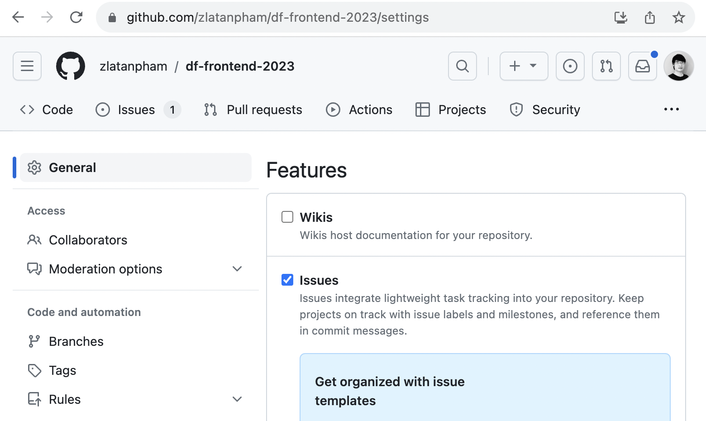

# Frontend Training 2023

Welcome to the Frontend Training 2023 repository! This is where you'll find exercises and templates meant to guide you through 8 training sessions on frontend development organized by [Dwarves Foundation](https://d.foundation/).

## Get Started

1. **Fork the Repository:** If you're a part of this class, kindly [fork](https://docs.github.com/en/get-started/quickstart/fork-a-repo#forking-a-repository) this repository.
2. **Set Your Fork to Public:** This helps us in evaluating and collaborating on your assignments.
3. **Syncing and Updates:** After every session, we will push relevant assignments here. Ensure you [sync your forked repository](https://docs.github.com/en/pull-requests/collaborating-with-pull-requests/working-with-forks/syncing-a-fork) to pull the exercise templates.

## Assignments Schedule

| Day | Topic                                                                     | Deadline   |
| --- | ------------------------------------------------------------------------- | ---------- |
| 1   | [HTML, CSS & JavaScript](./assignment-1/)                                 | 21/09/2023 |
| 2   | [React & State management](./assignment-2/)                               | 26/09/2023 |
| 3   | [Tooling: Webpack, Babel, TypeScript, ESLint & Prettier](./assignment-3/) | 01/10/2023 |
| 4   | [NextJS & TailwindCSS](./assignment-4/)                                   | 06/10/2023 |
| 5   | [Form handling](./assignment-5/)                                          | 08/10/2023 |
| 6   | [Authentication & API Integration](./assignment-6/)                       | 13/10/2023 |
| 7   | [Type-safe client server](./assignment-7/)                                | 15/10/2023 |
| 8   | [Final project](./final-project/)                                         | 24/10/2023 |

Stay tuned for updates on future assignments!

## Assignment Submission

To submit your assignments, please ensure you have enabled the **Issues** feature in your forked repository. If it's disabled by default, you can enable it by navigating to `Settings > General` on your fork. Scroll down to the `Features` sub-section and check the `Issues` box.

.

Once enabled, follow these steps for each submission:

1. **Code Submission**: Place your submitted code in the respective `/assignment-[number]` folder on your fork.
2. **Deployment**: Deploy your project on a cloud service to generate a public preview link.
3. **Issue Creation**: Open an issue in your forked repository with the title `Submission for assignment [number]`. Ensure you include the public preview link in the issue description. Refer to [this example issue](https://github.com/zlatanpham/df-frontend-2023/issues/1) for guidance.

## Evaluation Criteria

We evaluate assignments based on the following criteria:

- **Timeliness**: The assignment must be submitted by the deadline (based on the time of the last commit in the assignment folder).
- **Requirements Fulfillment**: The assignment must fulfill all mandatory requirements.

Our team will carefully assess your submissions. After evaluation, we'll share the results and offer feedback on the corresponding open issue.

## Support

Should you have any questions or run into any issues, don't hesitate to reach out on [our Discord](https://discord.com/invite/Y2vvH9rQE4). We are happy to help!

Best of luck with your training! 🌟
