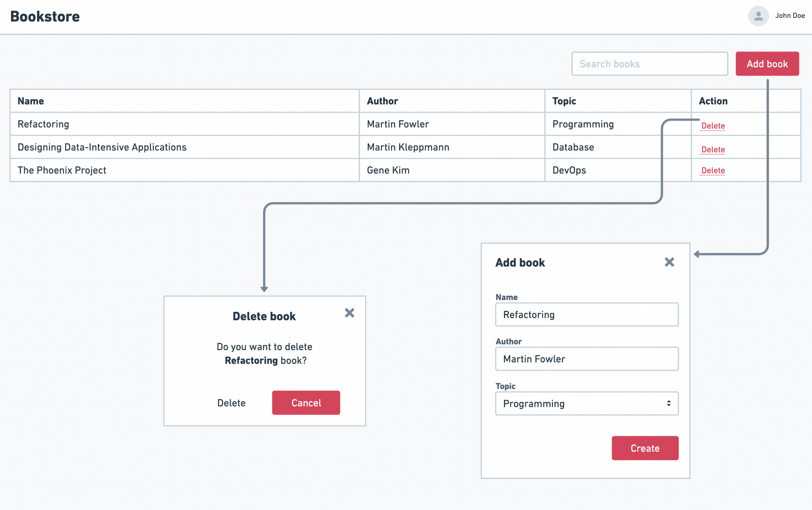

# HTML, CSS & JavaScript

Design and develop a simple bookstore Content Management System (CMS) table that lets users view and add records. For this task, you'll need to use HTML, CSS, and JavaScript to craft a user-friendly interface for content management.

.

### **Requirements**

- Set up an initial CMS table with columns for various attributes such as name, author, and topic.
- Fill the table with sample records or placeholder data.
- Enable book search by title.
- Permit users to input data for a new record and incorporate it into the table (no field validation necessary).
- Allow users to delete rows from the table.

**Assignment Deliverables**

- Craft the project using **HTML, CSS,** and **JavaScript**; no need for frameworks or libraries.
- The project should be deployable, and a demo link must be provided for review (While you can select any deployment platform, we've provided a [tutorial on using Vercel](https://dwarves.notion.site/Steps-to-Deploy-Your-Assignments-Using-Vercel-cff73a5fe1024e47a4f512bbb7f93c19) to simplify the process.)
- **Bonus:** Store the data in the browser's [localStorage](https://developer.mozilla.org/en-US/docs/Web/API/Window/localStorage).

**What Are We Looking For?**

- The objective here is to assess how you organize your work, employ JavaScript for basic DOM manipulations, utilize semantic HTML, and style elements like the table, input fields, and buttons with CSS.
- The app should be visually appealing, but there's no need to be overkill; a minimalist design is perfectly acceptable.

### Submission

- Begin your work using the html, js, and css files found in the assignment folder.
- Ensure all the assignment code resides in the `/assignment-1` directory.
- The final submission deadline is **21/09/2023**.
- After completing and setting up the deployable demo, [open a Github issue](https://docs.github.com/en/issues/tracking-your-work-with-issues/creating-an-issue) in your forked repository titled **Submission for assignment 1**. Include the demo link in the description.
