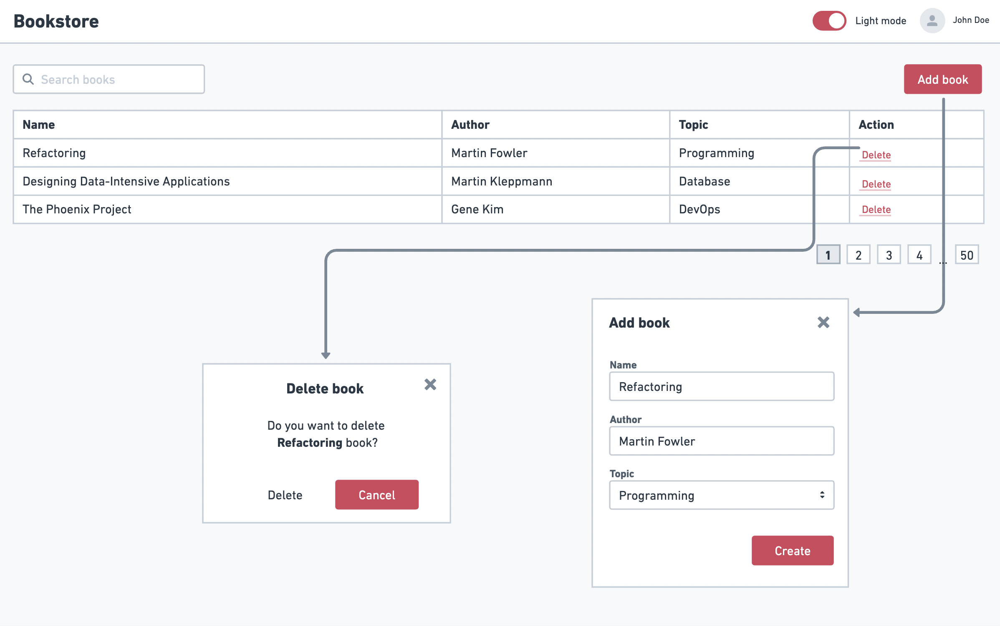

# React & State Management

In the previous assignment, we built a simple CMS table using just HTML, CSS, and JavaScript. For this assignment, you're tasked with recreating the same interface using React. This will allow us to appreciate how React enhances our approach to web app development.

.

## Requirements

- Port the functionality from [Assignment 01](../assignment-1/) into this React project.
- **New**: Introduce pagination for the table, allowing users to navigate between pages. Display 5 records per page.

### Deliverables

- Design the React project incorporating all essential components and functionalities.
- Ensure the project can be deployed. Provide a demo link for review. While you can choose any deployment platform, we've included [a tutorial](https://www.notion.so/Steps-to-Deploy-Your-Assignments-Using-Vercel-cff73a5fe1024e47a4f512bbb7f93c19?pvs=21) on using Vercel to guide you through the process.
- **Bonus**: Enhance user experience by adding a toggle for light/dark mode themes.

### What Are We Looking For?

- Proper structuring of React components and effective state management with Hooks.
- Full implementation of all listed features.
- Adherence to styling and design principles to produce a visually appealing, minimalist UI.

## Submission

- Begin your work using the template found in the assignment folder. This project is bootstrapped by [Create React App](https://create-react-app.dev/). Visit the document to see the details but you can use the following commands to start the project:
  ```bash
  # Install packages
  npm install
  # Run the app in development mode
  npm start
  # Build the app for production
  npm run build
  ```
- Ensure all the assignment code resides in the `/assignment-2` directory.
  The final submission deadline is **26/09/2023**.
- After completing and setting up the deployable demo, open a Github issue in your forked repository titled **Submission for assignment 2**. Include the demo link in the description.
