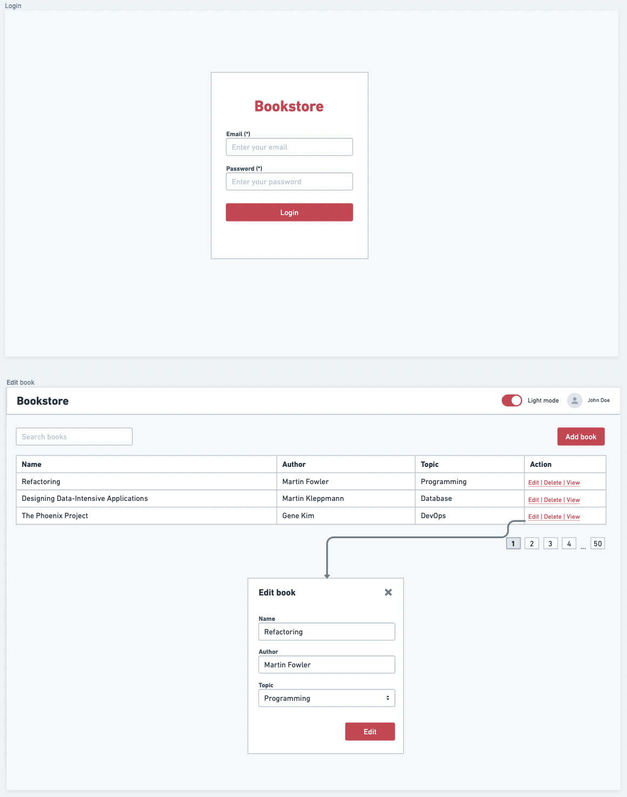

# Form Handling

Improve our [Assignment 04's Next.js application](../assignment-4/) application by adding an "Edit" feature for book details. Also, integrate a user-friendly and secure login page while ensuring a rigorous form validation system throughout the application. This enhancement aims to bolster the user experience and the overall security of the platform.

  

## Requirements

1. Use the functionalities from [Assignment 04](../assignment-4/) as a foundation.
2. Augment the book details page with an "Edit" button.
3. The 'Edit' button should trigger a modal window containing a pre-filled form with the current book details. This allows users to update the information and save changes.
4. Introduce a login page with a form that captures:
   - Email
   - Password
5. All forms should have validation and user-friendly error indicators.

### Validation rules

**Book Creation/Editing:**

- Book name: Minimum of 5 characters, required.
- Author name: Only letters and spaces, required.
- Book topic: Must select from available options, required.

**Login Form:**

- Email: Valid email pattern, required.
- Password: Minimum of 8 characters with at least 1 uppercase and 1 symbol, required.

### Deliverables

- Well-crafted Typescript NextJS Project with fully formatted, all the necessary components, functionalities, and error-free.
- Ensure that form UI reflect an error state and display an appropriate message when an error occurs.
- Ensure your code is fully formatted and adheres to comprehensive coding conventions.
- Ensure the project is deployable and provide a demo link for review.
- **Bonus**: Implement a [Password Strength Meter](https://www.passwordmonster.com/). For password fields, display a dynamic strength meter that updates based on password complexity.

### What Are We Looking For?

- Effective use of form hooks and robust validation techniques.
- Full implementation of all features listed in the requirements.
- Demonstrated improvement and incorporation of feedback received from previous assignments.

## Submission

- Ensure all assignment code is placed within the **`/assignment-5`** directory. You should transfer all of the application code from your Assignment 04 and relocate it to this folder.
- The final submission deadline is **08/10/2023**.
- After finalizing and ensuring a deployable demo, open a Github issue in your forked repository titled "**Submission for Assignment 5.**" Include the demo link in the description.
