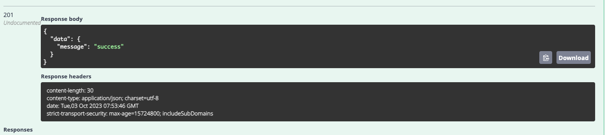

# Authentication & API Integration

With your foundational work from Assignments 04 & 05, it's time to turn your Next.js application into a dynamic powerhouse by integrating with a backend API. The goal for this assignment is to introduce the integration of backend services, understand protected routes, and API caching mechanism.

Refer to the API documentation at: [**Bookstore API Docs**](https://develop-api.bookstore.dwarvesf.com/swagger/index.html).

## **Requirements**

- Begin by incorporating the functionalities already built in the Next.js application from [Assignment 05](../assignment-5/).
- Seamlessly integrate the APIs into the UI.
- Protect all routes, exempting the `/login` route. Unauthorized access to protected routes should redirect the user back to the login page.
- Incorporate a "Log out" button prominently within the application header. This button should effectively log out the user and redirect to the login page.
- Implement caching for the responses obtained from GET APIs. The intention is to provide an almost instantaneous loading experience for the end user.

**Create account to authorize APIs**

- Head to API swagger documentation at: [**Bookstore API Docs**.](https://develop-api.bookstore.dwarvesf.com/swagger/index.html#/Auth/signup)
- Expand the accordion row [POST] `auth/signup`.
- Next, click on `Try it out` button, and input the account information into the body data.
- After that, click on the `Execute` button to make the API call.
- If you receive the status below, it means your account has been successfully created.

### **Deliverables**

- Ensure that the form, authentication mechanisms, data caching, and protected routes correctly represent their intended states.
- Assure that the code is thoroughly formatted and aligns with comprehensive coding conventions.
- Confirm the project's deployability and, as proof, provide a working demo link for review and assessment.
- **Bonus:** Revoke access if an API responds 401 error code.
- **Bonus:** Elevate your application's security and performance by storing user credentials securely using cookies and implementing Server Side Rendering (SSR) for all the pages.

### **What Are We Looking For?**

- Proficiently leveraging data fetching, SWR, and navigating protected routes with authentication.
- Completing the implementation of all the features outlined in the requirements.
- Demonstrating clear improvement and the successful integration of feedback received from previous assignments.

## **Submission**

- Ensure all assignment code is neatly contained within the **`/assignment-6`** directory. Transfer any necessary application code from your previous assignments into this directory.
- The last date to ensure your submission is **13/10/2023**.
- Upon finalizing your work and ensuring that your demo is deployable, initiate a Github issue in your forked repository titled "**Submission for Assignment 6**." Remember to include the demo link within the issue's description for easy accessibility.
